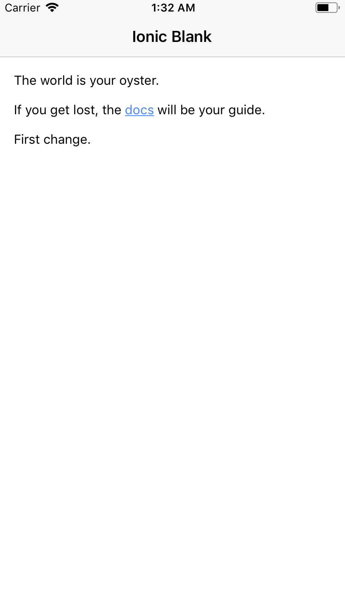

# cordova-code-push + Ionic example

Example of how to set up a basic Ionic APP with the code-push cordova plugin.

## Prepare the Ionic APP

`ionic start codepush-ionic-test blank`

`cd codepush-ionic-test`

`ionic cordova plugin add cordova-plugin-code-push`

`sudo npm install --save @ionic-native/code-push`

`ionic cordova platform add ios`

`ionic cordova platform add android`

## Code push set up

`sudo npm install`

`sudo npm install -g code-push-cli`

`code-push login`

> This command will open the browser and you will have to create an account with the code-push cloud services (you can use your Github, Google, Hotmail one). After successful sign-up, you must copy the token provided by the browser in the terminal.

`code-push app add codepush-ionic-test-ios ios cordova`

`code-push app add codepush-ionic-test-android android cordova`

> It's better to add two different apps in your code-push account for each platform so you can handle them separately.

**See again the deployment keys:**

`code-push deployment ls codepush-ionic-test-android -k`

`code-push deployment ls codepush-ionic-test-ios -k`

Now set up these keys in your **config.xml**:
```xml
<platform name="android">
    <preference name="CodePushDeploymentKey" value="YOUR-ANDROID-DEPLOYMENT-KEY" />
</platform>
<platform name="ios">
    <preference name="CodePushDeploymentKey" value="YOUR-IOS-DEPLOYMENT-KEY" />
</platform>
```

Modify **src/app/app.module.ts** (to set `CodePush` as provider):

```typescript
import { BrowserModule } from '@angular/platform-browser';
import { ErrorHandler, NgModule } from '@angular/core';
import { IonicApp, IonicErrorHandler, IonicModule } from 'ionic-angular';
import { SplashScreen } from '@ionic-native/splash-screen';
import { StatusBar } from '@ionic-native/status-bar';

import { MyApp } from './app.component';
import { HomePage } from '../pages/home/home';

import { CodePush } from '@ionic-native/code-push';

@NgModule({
  declarations: [
    MyApp,
    HomePage
  ],
  imports: [
    BrowserModule,
    IonicModule.forRoot(MyApp)
  ],
  bootstrap: [IonicApp],
  entryComponents: [
    MyApp,
    HomePage
  ],
  providers: [
    StatusBar,
    SplashScreen,
    CodePush,
    {provide: ErrorHandler, useClass: IonicErrorHandler}
  ]
})
export class AppModule {}

```

Finally, use the plugin! Modify **src/app.component.ts** (this basic set up will show an **alert** to handle **updates**):

```typescript
import { Component } from '@angular/core';
import { Platform } from 'ionic-angular';
import { StatusBar } from '@ionic-native/status-bar';
import { SplashScreen } from '@ionic-native/splash-screen';

import { HomePage } from '../pages/home/home';

import { CodePush, InstallMode, SyncStatus } from '@ionic-native/code-push';
import { AlertController } from 'ionic-angular/components/alert/alert-controller';

@Component({
  templateUrl: 'app.html'
})
export class MyApp {
  rootPage:any = HomePage;

  constructor(platform: Platform, statusBar: StatusBar, splashScreen: SplashScreen,
              private codePush: CodePush,  private alertCtrl: AlertController) {
    platform.ready().then(() => {
      // Okay, so the platform is ready and our plugins are available.
      // Here you can do any higher level native things you might need.
      statusBar.styleDefault();
      splashScreen.hide();
      this.checkCodePush(); //Use the plugin always after platform.ready()
    });
  }

  checkCodePush() {
    
     this.codePush.sync({
      updateDialog: {
       appendReleaseDescription: true,
       descriptionPrefix: "\n\nChange log:\n"   
      },
      installMode: InstallMode.IMMEDIATE
   }).subscribe(
     (data) => {
      console.log('CODE PUSH SUCCESSFUL: ' + data);
      
     },
     (err) => {
      console.log('CODE PUSH ERROR: ' + err);
      
     }
   );
  }

}
```

> **Note**: to handle more advanced code-push sync options, as creating your custom mechanism of handling updates with custom UI, etc., you should check out the [cordova code-push plugin API reference and examples](https://github.com/Microsoft/cordova-plugin-code-push#api-reference).

Now, you should build your app and test it in your emulator/physical device. You will be only building it once, and then releasing the updates throw code-push.

`ionic cordova build ios`

`ionic cordova run ios`

`ionic cordova build android`

`ionic cordova run android`

## Release the updates

**Each time** you modify anything in your code, you release an update like this:

`ionic cordova prepare ios`

`code-push release codepush-ionic-test-ios ./platforms/ios/www/ 0.0.1 --description "Your awesome change description" -d "Staging"` (the `-d` flag can be "Production" or "Staging", so you can manage and test your releases against staging APPs)

`ionic cordova prepare android`

`code-push release codepush-ionic-test-android ./platforms/android/app/src/main/assets/www/ 0.0.1 --description "Your awesome change description" -d "Staging"` (the `-d` flag can be "Production" or "Staging", so you can manage and test your releases against staging APPs)

> :warning: The path changes from `cordova-android` 6 to 7. So in <= 6.x it's ./platforms/android/assets/www/ and and in >= 7.x it's ./platforms/android/app/src/main/assets/www/. Just check your `cordova-android` package version in the `package.json` file.

> **Note**: the update will only be released for those devices matching the 0.0.1 version of your app.

### Releasing updates pro tips

If you would like to release an update but not make it available until you specify it, you could release the update with the disabled mode enabled. Like this:

`ionic cordova prepare android `

`code-push release codepush-ionic-test-android ./platforms/android/assets/www/ 0.0.1 --description "Your awesome change description" -x true` (see the `-x` flag, that marks the release as disabled)

This would send the release to the code push server, but it won't be downloable by the users. Then, whenever you want to, you would mark the release as not disabled, and thus immediately downloable, with the following command:

`code-push patch codepush-ionic-test-android Staging -x false`

What happens if we make a mistake in the release? We could rollback the release. This would make this release unavailable for the users, and would also make available the prior release to the one you are rollbacking available again for donwload. You can make a rollback with the following command:

`code-push rollback codepush-ionic-test-android Staging`

> **Note**: check out the [code-push cli README](https://github.com/Microsoft/code-push/tree/master/cli) for a more advanced use.

## Screenshots app update



